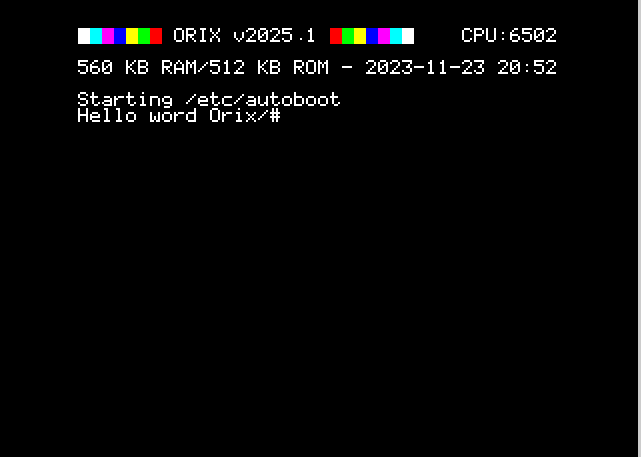

# Tutorial

## Binary command (C language)

```bash
$ mkdir pong
$ cd pong
$ bpm new
This project is :
1) A binary program
2) A library
3) A rom
answer ? 1
Init bpm.tml
Init src folder
Init src/tmp.c
Init VERSION file
Add github action main.yml into project: y/N ?N
initialized
```

Set oricutron path (global)

```bash
~$ bpm config oricutron_path /mnt/c/Users/myfolder/OneDrive/oric/oricutron_plugins/oricutron
```

```bash
~$ bpm run
```



## Library (Assembly language only)

```bash
~$ mkdir gizmo && cd gizmo
~$ bpm new
This project is :
1) A binary program
2) A library
3) A rom
answer ?2
Init .gitignore
Init bpm.tml
Init src folder
Init VERSION file
Add github action main.yml into project: y/N ?N
initialized
~$ tree
.
├── bpm.tml
├── docs
├── src
│   └── dynamic_lib
│       └── gizmo.s
└── VERSION

~$ bpm build
Creating build/etc/bpm/gizmo/2025.1
Generate gizmo.lib
Building gizmo.llo
No build done

~$ tree
.
├── bpm.tml
├── bpmtmp
│   └── gizmo.o
├── build
│   ├── etc
│   │   └── bpm
│   │       └── gizmo
│   │           └── 2025.1
│   │               └── bpm.tml
│   └── usr
│       ├── lib
│       │   └── gizmo
│       │       └── 2025.1
│       │           └── llo
│       │               └── gizmo.lib
│       └── share
│           └── gizmo
│               └── 2025.1
├── docs
├── src
│   └── dynamic_lib
│       ├── gizmo.s
│       ├── gizmo_so.o
│       └── gizmo_so.s
└── VERSION

```

Add a binary to test a library :

This commands add "curl" binary name with "tests/curl.c" path and "arg1 arg2" which will be passed into Orix path

```bash
bpm config add project binary curl tests/curl.c "arg1 arg2"
```

## Publish

If this command, return an empty line :


```bash
set | grep BPM
BPM_PUBLISH_KEY=yourKey
```

Set a key for publishing

```bash
~$ vi ~/.bashrc
```

add :

export BPM_PUBLISH_KEY=yourKey

```bash
$ bpm publish
```

## Add a library (ex : netdb)

```bash
$ bpm search
orixsdk 2023.3 -   Orix Software Toolkit
netdb 2024.4 -  Network database operations
ksocket 2025.1 -  Only use this package in Kernel source code (socket management part)
ch395 2024.4 -  ch395 low hardware routine. Use socket lib for socket management under Orix
kch395 2025.1 -  Only for orix kernel
inet 2025.1 -  Provide inet_aton
socket 2025.2 -  Socket management https://orix-software.github.io/socketlib/api/
curl 2025.1 -  Curl lib for Orix https://orix-software.github.io/curllib/api/

$bpm add netdb@2024.4
```

## Use orixsdk macro

Verify if orixsdk plugins is installed (installed flag):

bpm plugins
Use 'bpm plugins -h' for 'plugins' help
md2hlp: Build markdown into hlp file (text mode) [Installed]
orixsdk: Useful ca65 macro for Orix and reloc binary (Mandatory for Orix projects)  (Available versions : ['2023.3.0']) *[Installed]*
asm_bin_tpl: Assembly binary template for Orix  (Available versions : ['2024.4']) [Installed]
asm_rom_tpl: Assembly rom template for Orix  (Available versions : ['2024.4']) [Installed]
github_action: Template for github action  (Available versions : ['2024.4']) [Installed]
generatedoc: Tool to comment source code and generate markdown  (Available versions : ['2025.1']) [Installed]

if the plugins is activated, macro can be loaded like :

.include "SDK_memory.mac"

## Add a 'pre' script before main command is launched

```bash
~$ mkdir scripts/
~$ echo "netchk" > scripts/network.sub
~$ bpm config set project orix_run_pre_script scripts/network.sub
```

## Add a md2hlp file

Create a file with "name" of the binary and build man page in markdown format. 
Launch "bpm doc" to generate .hlp for orix

Example with "myprogram" :

```bash
~$ vi docs/myprogram.md


```