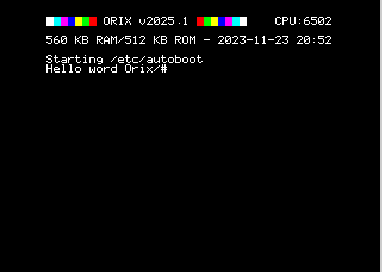

# Tutorial

## binary command (C language)

```bash
$ mkdir pong
$ cd pong
$ bpm new
This project is :
1) A binary program
2) A library
3) A rom
answer ? 1
Init bpm.tml
Init src folder
Init src/tmp.c
Init VERSION file
Add github action main.yml into project: y/N ?N
initialized
```

Set oricutron path (global)

```bash
~$ bpm config oricutron_path /mnt/c/Users/myfolder/OneDrive/oric/oricutron_plugins/oricutron
```

```bash
~$ bpm run
```

